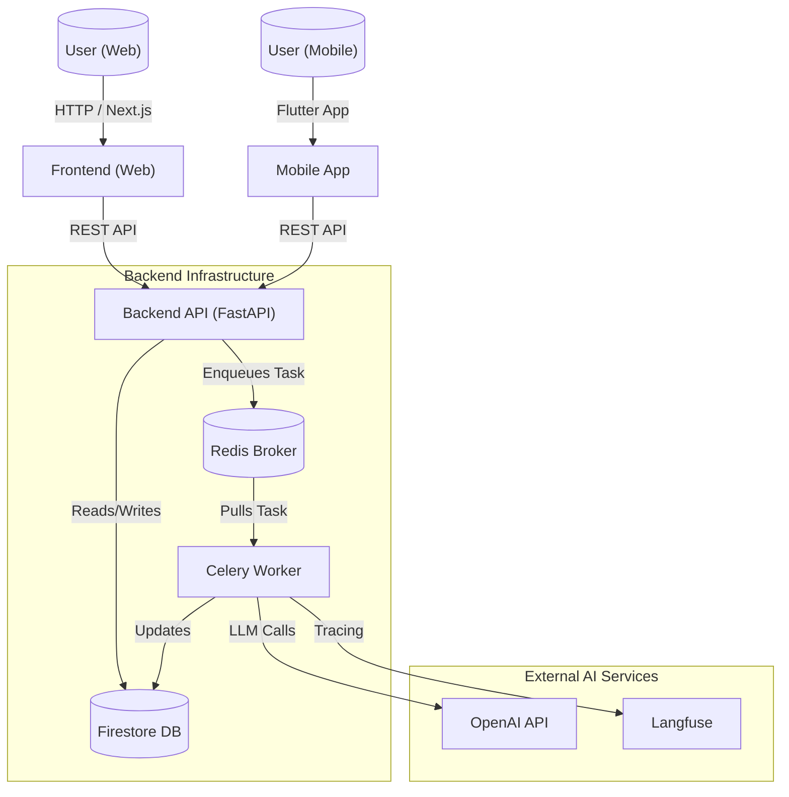

# ResQConnect
ResQConnect is an end-to-end, agentic disaster-response decision support system that turns incoming citizen requests into actionable guidance and allocations of emergency resources. It combines an agentic RAG pipeline (to retrieve and synthesise verified SOPs and local knowledge into safe, context-aware recommendations), a dynamic routing/dispatch optimisation layer (to prioritise incidents and assign responders under changing constraints) and an edge/offline component (so core guidance remains available when connectivity is limited). The goal is to improve timeliness, safety and consistency of response decisions while keeping outputs under human supervision .

https://savinimz.github.io/ResQConnect-docs/

## Project Structure

The codebase is organized into three main components:

-   **`backend/`**: A robust API using FastAPI, managing data, authentication, and AI services.
-   **`frontend/`**: A modern web interface built with Next.js and Tailwind CSS for users and administrators.
-   **`mobile/`**: A cross-platform mobile application developed with Flutter for on-the-go access.

## Architecture



## Tech Stack

### Backend
-   **Framework**: FastAPI 
-   **Asynchronous Tasks**: Celery with Redis
-   **AI & LLM Integration**: Langfuse, OpenAI
-   **Database**: Firestore 
-   **Containerization**: Docker

### Frontend
-   **Framework**: Next.js 
-   **Styling**: Tailwind CSS, Radix UI
-   **State Management**: React Query, Context API
-   **Authentication**: Firebase Auth

### Mobile
-   **Framework**: Flutter 
-   **State Management**: Provider
-   **Maps**: Location services integrated

---

## Getting Started

### Prerequisites

Ensure you have the following installed on your system:
-   **Node.js** (v18+ recommended)
-   **Python** (v3.9+)
-   **Flutter SDK**
-   **Docker** & **Docker Compose** (optional, for containerized backend)

### 1. Backend Setup

Navigate to the `backend` directory:
```bash
cd backend
```

**Manual Setup:**
1.  Create a virtual environment:
    ```bash
    python -m venv venv
    source venv/bin/activate  # On Windows: venv\Scripts\activate
    ```
2.  Install dependencies:
    ```bash
    pip install -r requirements.txt
    ```
3.  Set up environment variables (see [Environment Configuration](#environment-configuration)).
4.  Run the server:
    ```bash
    uvicorn app.main:app --reload
    ```

**Docker Setup:**

1.  **Setup Secrets**:
    *   Create a directory: `backend/app/secrets/` inside the `backend` folder.
    *   Place your `firebase_cred.json` in this directory.
    *   *Critical: Docker mounts this file into the container to allow Firestore access.*

2.  **Configure Environment**:
    *   Ensure your `backend/.env` file is created (see [Environment Configuration](#environment-configuration)).

3.  **Run Services**:
    ```bash
    docker-compose up --build
    ```

**Running Celery Worker:**
1.  Ensure Redis is running and accessible.
2.  From the `backend` directory, run:
    ```bash
    celery -A app.celery_config.celery_app worker --loglevel=info --pool=solo
    ```
    *(Note: `--pool=solo` is recommended for Windows environments. For Linux/Mac, you can omit it or use `--pool=prefork`)*.

### 2. Frontend Setup

Navigate to the `frontend` directory:
```bash
cd frontend
```

1.  Install dependencies:
    ```bash
    npm install
    # or
    yarn install
    ```
2.  Set up environment variables.
3.  Run the development server:
    ```bash
    npm run dev
    ```
    Open [http://localhost:3000](http://localhost:3000) in your browser.

### 3. Mobile Setup

Navigate to the `mobile` directory:
```bash
cd mobile
```

1.  Get dependencies:
    ```bash
    flutter pub get
    ```
2.  Run the app (ensure an emulator is running or a device is connected):
    ```bash
    flutter run
    ```

---

## Environment Configuration

Each component requires specific environment variables. Create a `.env` file in the respective directories.

### Backend (`backend/.env`)
```env
GOOGLE_APPLICATION_CREDENTIALS=path/to/firebase_cred.json
OpenAI_API_KEY=your_openai_api_key
LANGFUSE_SECRET_KEY=your_langfuse_secret
LANGFUSE_PUBLIC_KEY=your_langfuse_public
LANGFUSE_HOST=https://cloud.langfuse.com
REDIS_HOST=
REDIS_PORT=
REDIS_USERNAME=
REDIS_PASSWORD=
CELERY_BROKER_URL=
TAVILY_API_KEY=
```

### Frontend (`frontend/.env.local`)
Create a `.env.local` file in the `frontend` directory with the following variables:

```env
NEXT_PUBLIC_FIREBASE_API_KEY=your_api_key
NEXT_PUBLIC_FIREBASE_AUTH_DOMAIN=your_project.firebaseapp.com
NEXT_PUBLIC_FIREBASE_PROJECT_ID=your_project_id
NEXT_PUBLIC_FIREBASE_STORAGE_BUCKET=your_project.appspot.com
NEXT_PUBLIC_FIREBASE_MESSAGING_SENDER_ID=your_sender_id
NEXT_PUBLIC_FIREBASE_APP_ID=your_app_id
NEXT_PUBLIC_API=http://localhost:8000
```

---
