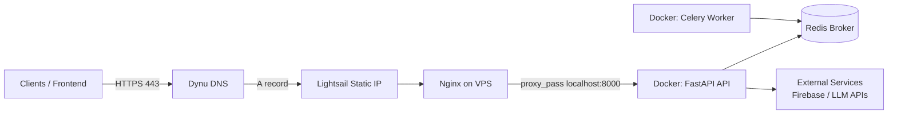
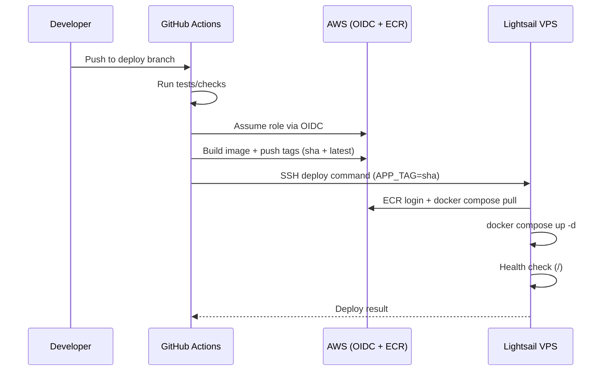

# DEPLOYMENT GUIDE

## 1. Scope

This document defines a production deployment architecture for the backend using:

- Amazon Lightsail VPS (host server)
- Docker + Docker Compose (API and worker containers)
- Nginx (reverse proxy)
- Certbot (Let's Encrypt TLS certificates)
- Dynu DNS (free DNS provider)
- GitHub Actions CI/CD (build, push to ECR, deploy to VPS)
- Amazon ECR (container registry)

It is tailored to this repository (`backend`) and current runtime design (`api` + `worker` services in `docker-compose.yml`).

## 2. Target Architecture





## 3. Prerequisites

- Lightsail Ubuntu instance (recommended Ubuntu 22.04+)
- Static IP attached to the instance
- Domain/subdomain in Dynu (for example: `api.yourname.dynu.net`)
- AWS account with ECR repository
- GitHub repository with Actions enabled
- SSH access to the VPS

## 4. One-Time Infrastructure Setup

### 4.1 Create AWS ECR Repository

```bash
aws ecr create-repository --repository-name resqconnect-backend --region <aws-region>
```

Capture:

- `ECR_REGISTRY` = `<account-id>.dkr.ecr.<region>.amazonaws.com`
- `ECR_REPOSITORY` = `resqconnect-backend`

### 4.2 Bootstrap the Lightsail VPS

```bash
sudo apt update && sudo apt upgrade -y
sudo apt install -y nginx certbot python3-certbot-nginx docker.io docker-compose-plugin awscli

sudo systemctl enable --now nginx
sudo systemctl enable --now docker
sudo usermod -aG docker $USER
```

Log out/in once after `usermod` so Docker group applies.

Optional host firewall:

```bash
sudo ufw allow OpenSSH
sudo ufw allow 'Nginx Full'
sudo ufw enable
```

### 4.3 Create Runtime Directory on VPS

```bash
sudo mkdir -p /opt/resqconnect/backend/app/secrets
sudo chown -R $USER:$USER /opt/resqconnect
cd /opt/resqconnect/backend
```

Place these files in `/opt/resqconnect/backend`:

- `docker-compose.yml`
- `.env` (app environment values)
- `app/secrets/firebase_cred.json`

## 5. Dynu DNS Setup

In Dynu DNS panel:

1. Create/choose your host (for example `api.yourname.dynu.net`).
2. Add `A` record pointing to your Lightsail static IPv4 address.
3. Set TTL to `60` or `300` while setting up; increase later if desired.

Verify propagation:

```bash
nslookup api.yourname.dynu.net
```

Expected: returns your Lightsail static IP.

## 6. Nginx + HTTPS (Certbot)

### 6.1 Nginx Site Config

Create `/etc/nginx/sites-available/resqconnect`:

```nginx
server {
    listen 80;
    server_name api.yourname.dynu.net;

    location / {
        proxy_pass http://127.0.0.1:8000;
        proxy_set_header Host $host;
        proxy_set_header X-Real-IP $remote_addr;
        proxy_set_header X-Forwarded-For $proxy_add_x_forwarded_for;
        proxy_set_header X-Forwarded-Proto $scheme;
    }
}
```

Enable and validate:

```bash
sudo ln -s /etc/nginx/sites-available/resqconnect /etc/nginx/sites-enabled/resqconnect
sudo nginx -t
sudo systemctl reload nginx
```

### 6.2 Issue TLS Certificate

```bash
sudo certbot --nginx -d api.yourname.dynu.net --agree-tos -m <your-email> --redirect
```

Certbot updates Nginx config to force HTTPS automatically.

### 6.3 Verify Renewal

```bash
sudo certbot renew --dry-run
systemctl list-timers | grep certbot
```

## 7. Docker Runtime Configuration

Use your existing `docker-compose.yml` with ECR image values:

```bash
export APP_IMAGE=<account-id>.dkr.ecr.<region>.amazonaws.com/resqconnect-backend
export APP_TAG=<sha-or-latest>
docker compose pull
docker compose up -d
```

Security recommendation: expose API container only on localhost in production:

```yaml
ports:
  - "127.0.0.1:8000:8000"
```

This ensures only Nginx can reach the app.

## 8. CI/CD Design (GitHub Actions -> ECR -> Lightsail)

### 8.1 Recommended Deployment Flow

1. Push to deployment branch (`deploy`) or manual workflow dispatch.
2. Run test/check stage.
3. Build image once.
4. Push two tags:
- immutable tag: `sha-<commit>`
- mutable tag: `latest`
5. SSH into VPS and deploy immutable tag.
6. Run health check (`https://api.yourname.dynu.net/`).
7. If failed, trigger rollback to previous tag.

### 8.2 GitHub Secrets Required

AWS:

- `AWS_REGION`
- `AWS_ROLE_TO_ASSUME` (recommended with OIDC)
- `ECR_REGISTRY`
- `ECR_REPOSITORY`

VPS:

- `VPS_HOST`
- `VPS_USER`
- `VPS_SSH_KEY`

App secrets:

- `APP_ENV_VARS` (full `.env` content)
- `FIREBASE_CRED_JSON` (JSON string)

### 8.3 Example Workflow (`.github/workflows/deploy.yaml`)

```yaml
name: Deploy Backend

on:
  push:
    branches: [deploy]

jobs:
  deploy:
    runs-on: ubuntu-latest
    permissions:
      id-token: write
      contents: read

    steps:
      - uses: actions/checkout@v4

      - name: Configure AWS credentials (OIDC)
        uses: aws-actions/configure-aws-credentials@v4
        with:
          role-to-assume: ${{ secrets.AWS_ROLE_TO_ASSUME }}
          aws-region: ${{ secrets.AWS_REGION }}

      - name: Login to ECR
        uses: aws-actions/amazon-ecr-login@v2

      - name: Build and push image
        env:
          ECR_REGISTRY: ${{ secrets.ECR_REGISTRY }}
          ECR_REPOSITORY: ${{ secrets.ECR_REPOSITORY }}
          IMAGE_SHA: sha-${{ github.sha }}
        run: |
          docker build -t $ECR_REGISTRY/$ECR_REPOSITORY:$IMAGE_SHA -t $ECR_REGISTRY/$ECR_REPOSITORY:latest .
          docker push $ECR_REGISTRY/$ECR_REPOSITORY:$IMAGE_SHA
          docker push $ECR_REGISTRY/$ECR_REPOSITORY:latest

      - name: Deploy on Lightsail
        uses: appleboy/ssh-action@v1.2.0
        env:
          ECR_REGISTRY: ${{ secrets.ECR_REGISTRY }}
          ECR_REPOSITORY: ${{ secrets.ECR_REPOSITORY }}
          AWS_REGION: ${{ secrets.AWS_REGION }}
          IMAGE_SHA: sha-${{ github.sha }}
          APP_ENV_VARS: ${{ secrets.APP_ENV_VARS }}
          FIREBASE_CRED_JSON: ${{ secrets.FIREBASE_CRED_JSON }}
        with:
          host: ${{ secrets.VPS_HOST }}
          username: ${{ secrets.VPS_USER }}
          key: ${{ secrets.VPS_SSH_KEY }}
          envs: ECR_REGISTRY,ECR_REPOSITORY,AWS_REGION,IMAGE_SHA,APP_ENV_VARS,FIREBASE_CRED_JSON
          script: |
            set -e
            cd /opt/resqconnect/backend
            echo "$APP_ENV_VARS" > .env
            mkdir -p app/secrets
            echo "$FIREBASE_CRED_JSON" > app/secrets/firebase_cred.json
            aws ecr get-login-password --region "$AWS_REGION" | docker login --username AWS --password-stdin "$ECR_REGISTRY"
            export APP_IMAGE="$ECR_REGISTRY/$ECR_REPOSITORY"
            export APP_TAG="$IMAGE_SHA"
            docker compose pull
            docker compose up -d
            curl -fsS http://127.0.0.1:8000/
            docker image prune -f
```

### 8.4 VPS Pull Permissions for ECR

On the VPS, use AWS credentials with minimum pull-only access:

- `ecr:GetAuthorizationToken`
- `ecr:BatchCheckLayerAvailability`
- `ecr:GetDownloadUrlForLayer`
- `ecr:BatchGetImage`

Store credentials in `~/.aws/credentials` for deploy user, or inject as secure environment variables.

## 9. Deployment Runbook

### 9.1 Manual Deploy (Emergency)

```bash
cd /opt/resqconnect/backend
aws ecr get-login-password --region <region> | docker login --username AWS --password-stdin <ecr-registry>
export APP_IMAGE=<ecr-registry>/resqconnect-backend
export APP_TAG=sha-<commit>
docker compose pull
docker compose up -d
curl -fsS http://127.0.0.1:8000/
```

### 9.2 Verify Public Endpoint

```bash
curl -I https://api.yourname.dynu.net/
curl https://api.yourname.dynu.net/
```

Expected JSON:

```json
{"status":"ok"}
```

### 9.3 Rollback

```bash
cd /opt/resqconnect/backend
export APP_IMAGE=<ecr-registry>/resqconnect-backend
export APP_TAG=sha-<previous-good-commit>
docker compose pull
docker compose up -d
```

## 10. Security Hardening Checklist

- Use immutable deploy tag (`sha-...`), not only `latest`.
- Restrict API container bind to localhost (`127.0.0.1:8000:8000`).
- Keep `.env` and Firebase JSON out of git.
- Use least-privilege IAM for GitHub and VPS pull access.
- Prefer GitHub OIDC over long-lived AWS keys in Actions.
- Rotate certificates/keys periodically.
- Limit inbound ports on Lightsail networking/firewall to `22`, `80`, `443`.
- Monitor logs for auth failures and repeated 5xx errors.

## 11. Observability and Troubleshooting

Useful commands on VPS:

```bash
docker compose ps
docker compose logs -f api
docker compose logs -f worker
sudo nginx -t
sudo systemctl status nginx
sudo journalctl -u nginx -n 100 --no-pager
sudo certbot certificates
```

Common issues:

- `502 Bad Gateway`: API container not running, wrong `proxy_pass`, or app failed startup.
- TLS issuance fails: DNS record not propagated or port 80 blocked.
- ECR pull denied: missing AWS credentials/permissions on VPS.
- Deploy succeeds but app broken: add/strengthen post-deploy health checks before marking success.

## 12. Current Repository Alignment Notes

- Existing compose file already supports image overrides via `APP_IMAGE` and `APP_TAG`.
- Existing workflow (`.github/workflows/deploy.yaml`) can be evolved to include immutable tags.
- Rename EC2 references to Lightsail for clarity.
- Add health-check fail-fast behavior after deployment.

