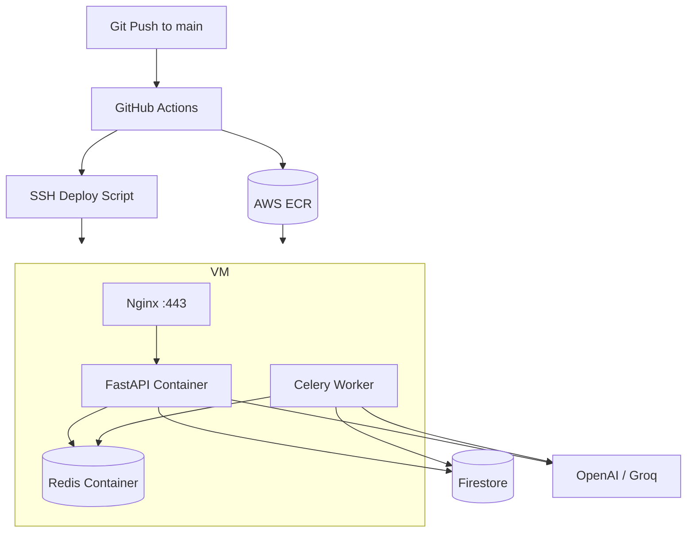
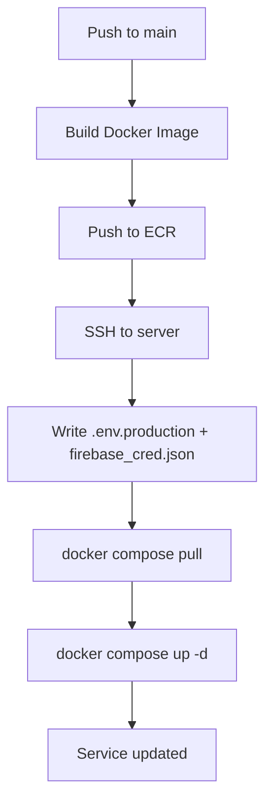

# ResQConnect Backend Deployment (Automated CI/CD to AWS ECR)

This is the updated deployment setup for the backend with:

- GitHub Actions CI/CD
- AWS ECR image registry
- Automatic remote deployment over SSH
- Nginx reverse proxy + HTTPS (Let's Encrypt)
- DuckDNS domain

Last updated: **March 26, 2026**

## 1. Final Architecture



## 2. What Is Automated vs Manual

Automated on every deploy:

- Build backend Docker image
- Push image to ECR (`latest` + commit SHA)
- Copy deployment artifacts to server
- Write `.env.production` and `firebase_cred.json` from GitHub Secrets
- Pull new image and restart containers

One-time manual setup only:

- Provision server (Lightsail/EC2)
- Install Docker + Nginx
- Configure DuckDNS + HTTPS certificate
- Configure GitHub Secrets/Variables and AWS OIDC role

## 3. Files Used by the New Setup

- Workflow: `.github/workflows/backend-deploy.yml`
- Production compose: `backend/docker-compose.prod.yml`
- Remote deploy script: `backend/deploy/remote_deploy.sh`
- Bootstrap script: `backend/deploy/bootstrap_server.sh`
- CI/CD setup reference: `backend/deploy/CI_CD_SETUP.md`

## 4. One-Time Server Setup

## Step 1: Provision server

- Ubuntu 22.04/24.04
- Open ports: `22`, `80`, `443`
- Assign static public IP

## Step 2: Clone repo and bootstrap

```bash
cd /opt
git clone <YOUR_REPO_URL> resqconnect
cd /opt/resqconnect/backend
chmod +x deploy/bootstrap_server.sh
./deploy/bootstrap_server.sh
```

Default deploy path:

- `/opt/resqconnect/backend`

## Step 3: Configure Nginx reverse proxy

Create `/etc/nginx/sites-available/resqconnect-api`:

```nginx
limit_req_zone $binary_remote_addr zone=api_ratelimit:10m rate=10r/s;

server {
    listen 80;
    server_name api-resqconnect.duckdns.org;

    client_max_body_size 20m;

    location / {
        limit_req zone=api_ratelimit burst=20 nodelay;

        proxy_pass http://127.0.0.1:8000;
        proxy_http_version 1.1;
        proxy_set_header Host $host;
        proxy_set_header X-Real-IP $remote_addr;
        proxy_set_header X-Forwarded-For $proxy_add_x_forwarded_for;
        proxy_set_header X-Forwarded-Proto $scheme;
        proxy_read_timeout 300;
    }
}
```

Enable it:

```bash
sudo ln -sf /etc/nginx/sites-available/resqconnect-api /etc/nginx/sites-enabled/resqconnect-api
sudo nginx -t
sudo systemctl reload nginx
```

## Step 4: Enable HTTPS

```bash
sudo apt update
sudo apt install -y certbot python3-certbot-nginx
sudo certbot --nginx -d api-resqconnect.duckdns.org --redirect -m <YOUR_EMAIL> --agree-tos --no-eff-email
sudo certbot renew --dry-run
```

## Step 5: Optional hardening

Install fail2ban:

```bash
sudo apt install -y fail2ban
sudo systemctl enable --now fail2ban
```

## 5. GitHub Actions Configuration

In GitHub repository settings:

`Settings -> Secrets and variables -> Actions`

## Variables

- `AWS_REGION` (example: `ap-southeast-1`)
- `ECR_REPOSITORY` (example: `minionz/resqconnect-backend`)
- `DEPLOY_PATH` (example: `/opt/resqconnect/backend`)

## Secrets

- `AWS_GITHUB_ACTIONS_ROLE_ARN`
- `DEPLOY_HOST`
- `DEPLOY_USER`
- `DEPLOY_SSH_KEY`
- `APP_ENV_B64`
- `FIREBASE_CRED_B64`

Generate base64 secrets:

```bash
base64 -w 0 .env.production
base64 -w 0 app/secrets/firebase_cred.json
```

macOS:

```bash
base64 .env.production | tr -d '\n'
base64 app/secrets/firebase_cred.json | tr -d '\n'
```

## 6. AWS IAM (OIDC) Requirements

The role in `AWS_GITHUB_ACTIONS_ROLE_ARN` needs ECR permissions:

- `ecr:GetAuthorizationToken`
- `ecr:BatchCheckLayerAvailability`
- `ecr:CompleteLayerUpload`
- `ecr:InitiateLayerUpload`
- `ecr:PutImage`
- `ecr:UploadLayerPart`
- `ecr:DescribeRepositories`
- `ecr:CreateRepository`

OIDC trust must allow your GitHub repository to assume this role.

## 7. Deployment Flow



Workflow trigger:

- Push to `main` affecting `backend/**`
- Manual run via `workflow_dispatch`

Image tags used:

- `:<commit-sha>` (deployment target)
- `:latest` (convenience tag)

## 8. First Deployment Test

1. Ensure GitHub Secrets/Variables are complete.
2. Run workflow manually from Actions tab (`Backend Deploy (ECR -> Server)`).
3. Confirm service:

```bash
curl -I https://api-resqconnect.duckdns.org/
curl https://api-resqconnect.duckdns.org/
```

Expected health body:

```json
{"status":"ok"}
```

## 9. Rollback

Use previous working image SHA:

```bash
cd /opt/resqconnect/backend
echo "BACKEND_IMAGE=<ecr-registry>/<repo>:<old-commit-sha>" > .deploy.env
echo "COMPOSE_PROJECT_NAME=resqconnect" >> .deploy.env
docker compose --env-file .deploy.env -f docker-compose.prod.yml up -d
```

## 10. Frontend Integration

Set frontend environment:

```env
NEXT_PUBLIC_API=https://api-resqconnect.duckdns.org
```

Also ensure backend CORS is not wildcard in production.

## 11. Operations Checklist

- [ ] DuckDNS record points to server static IP
- [ ] Nginx active and proxying to `127.0.0.1:8000`
- [ ] HTTPS certificate valid and auto-renew tested
- [ ] GitHub OIDC role + secrets configured
- [ ] Workflow completes successfully
- [ ] API health endpoint returns `{"status":"ok"}`
- [ ] Frontend can call production API endpoint
