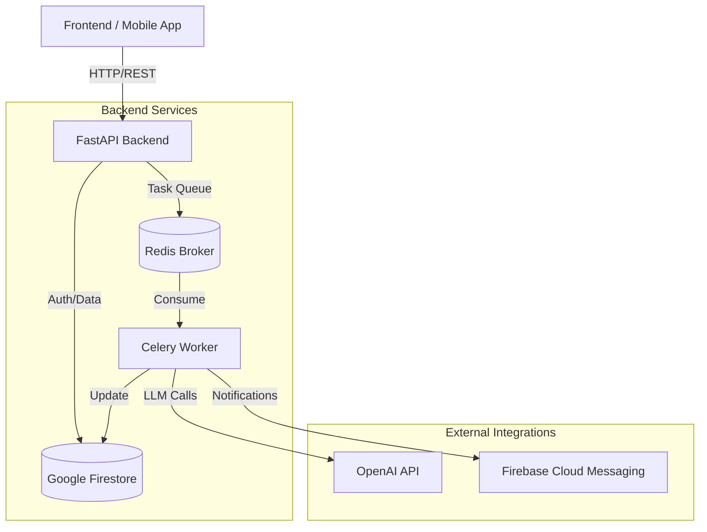

# Backend Architecture

## Overview

The ResQConnect backend is built using **FastAPI** (Python 3.10+) and follows a microservice-like architecture. It leverages **Google Firebase** (Firestore) for data persistence and authentication, and **Celery** with **Redis** for asynchronous task processing (primarily for AI agent workflows).

## High-Level Architecture



## Key Components

### 1. API Layer (FastAPI)
- **Role**: Handles HTTP requests, authenticates users, and validates input using Pydantic schemas.
- **Location**: `app/api/`
- **Key Modules**:
    - `auth.py`: User authentication and role management.
    - `requests.py`: CRUD operations for help requests.
    - `disaster.py`: Management of disaster events.

### 2. Data Layer (Firestore)
- **Role**: NoSQL Schema-less database for storing Users, Requests, Tasks, and Resources.
- **Location**: `app/core/firebase.py` (Connection logic), `app/crud/` (Data access logic).
- **Pattern**: Repository pattern via CRUD modules.

### 3. Asynchronous Task Queue (Celery)
- **Role**: Handles long-running or background tasks, such as:
    - AI Agent workflows (matching requests to resources).
    - Generating summaries or reports.
- **Location**: `app/celery_config.py`, `app/worker.py` (implied).

## Directory Structure

```
backend/
├── app/
│   ├── api/            # Route handlers
│   ├── core/           # Configuration & security
│   ├── crud/           # Database operations
│   ├── schemas/        # Pydantic models (Data validation)
│   ├── services/       # Business logic (if separated)
│   └── main.py         # Application entry point
├── tests/              # Pytest suite
└── requirements.txt    # Python dependencies
```
