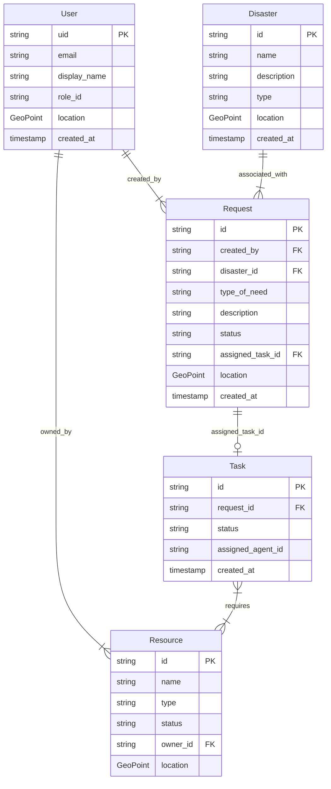

# Data Models and ER Diagrams

## Overview

The backend uses **Pydantic** models for data validation and schema definition, which map to **Firestore** documents.

## Entity Relationship Diagram

## Schema Definitions

### User

| Field      | Type     | Description                                                          |
| :--------- | :------- | :------------------------------------------------------------------- |
| `uid`      | String   | Unique identifier (Firebase Auth UID).                               |
| `email`    | String   | User's email address.                                                |
| `role_id`  | String   | Role identifier (e.g., `admin`, `responder`, `affected_individual`). |
| `location` | GeoPoint | Current location of the user (lat, lng).                             |

### Request

| Field          | Type     | Description                                                           |
| :------------- | :------- | :-------------------------------------------------------------------- |
| `id`           | String   | Unique identifier for the request.                                    |
| `disaster_id`  | String   | ID of the disaster event this request is related to.                  |
| `type_of_need` | String   | Type of help needed (e.g., `food`, `medical`).                        |
| `status`       | String   | Status of the request (`open`, `in_progress`, `fulfilled`, `closed`). |
| `location`     | GeoPoint | Location where help is needed.                                        |

### Disaster

| Field      | Type     | Description                                    |
| :--------- | :------- | :--------------------------------------------- |
| `id`       | String   | Unique identifier for the disaster.            |
| `name`     | String   | Name of the disaster event.                    |
| `location` | GeoPoint | Epicenter or primary location of the disaster. |
