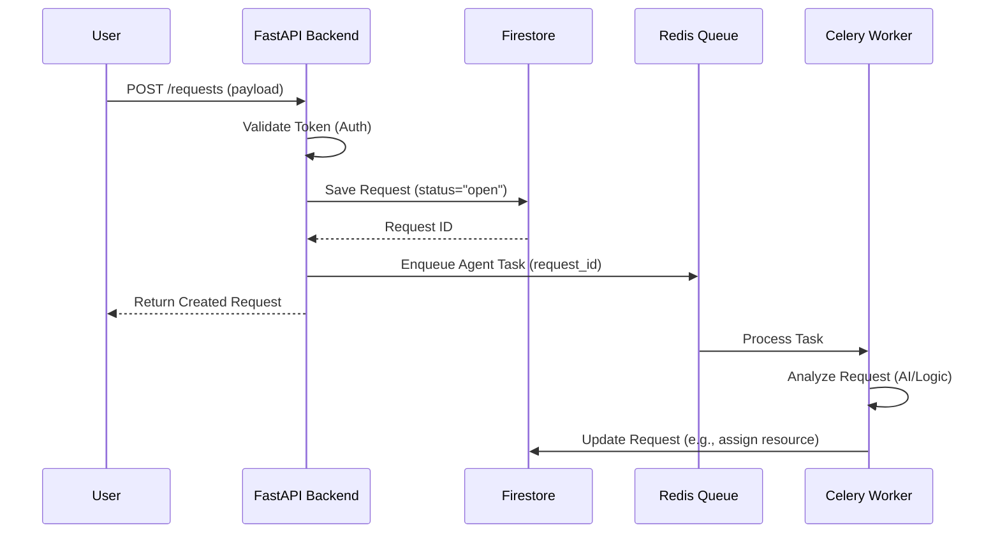
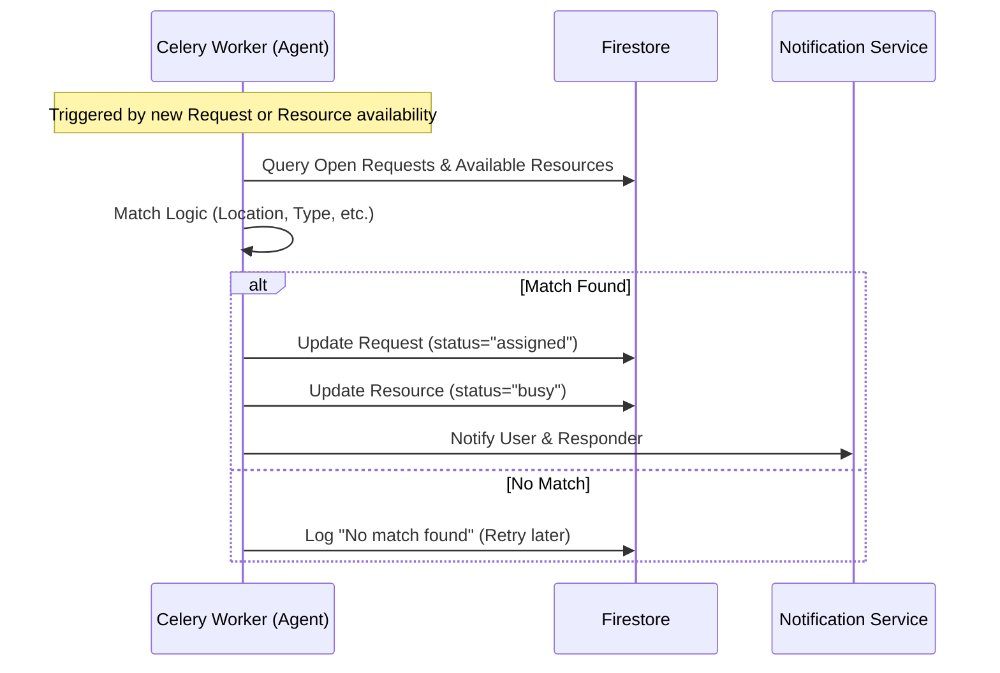

# Sequence Diagrams

## 1. Create Help Request Workflow

This diagram illustrates the flow when a user submits a new help request. The request is stored in Firestore, and an asynchronous task is triggered via Celery to process the request (e.g., matching it with available resources).

## 2. Resource Assignment Workflow (Simplifed)

This diagram shows how a resource is assigned to a request.

