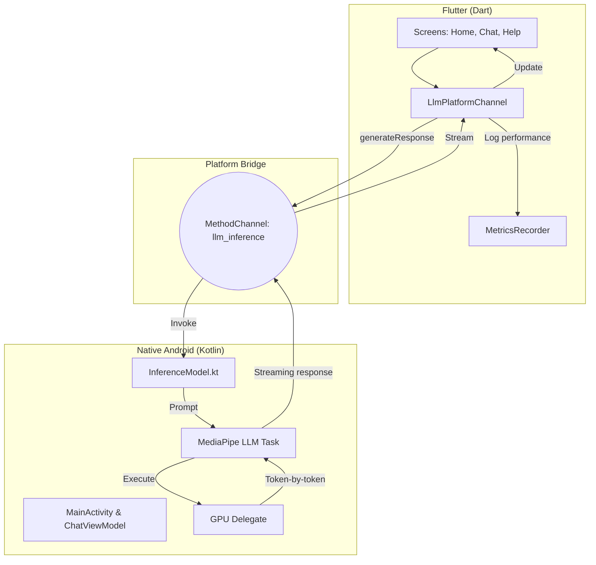
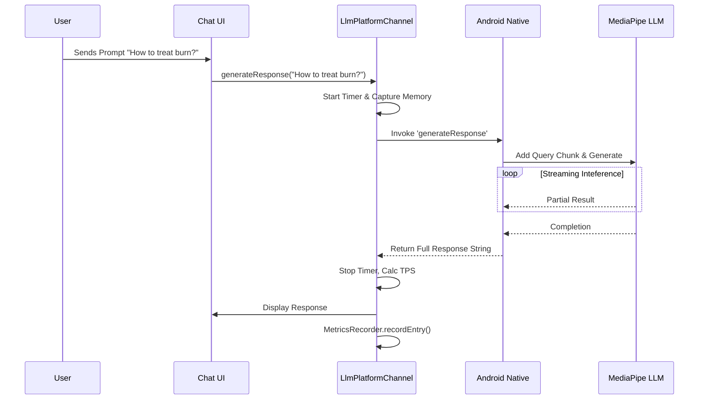
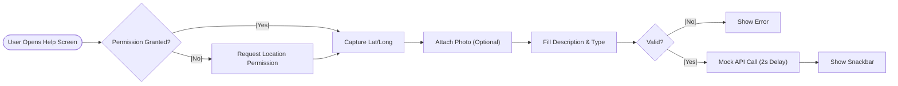

# Technical Review: ResQConnect-Edge

## 1. Executive Summary
**ResQConnect-Edge** is a hybrid mobile application built with **Flutter** that leverages on-device **Edge AI** capabilities. It functionality integrates a native Android **LLM (Large Language Model) Inference Engine** using Google's **MediaPipe**. The application is designed for emergency response scenarios, allowing users to request help and interact with an AI assistant locally, ensuring privacy and offline capability.

## 2. System Architecture

The application follows a layered architecture pattern:

1.  **Presentation Layer (Flutter)**: Handles UI/UX, user input, and state management.
2.  **Service Layer (Dart)**: Manages platform channels and metrics recording.
3.  **Bridge Layer (MethodChannel)**: Facilitates communication between Dart (Flutter) and Kotlin (Android).
4.  **Native Intelligence Layer (Android/Kotlin)**: Hosts the MediaPipe GenAI task for direct on-device inference using Gemma models (e.g., Gemma 2B/1.1B).

### System Component Diagram

## 3. Core Components Analysis

### A. Flutter Frontend (`lib/`)

*   **Entry Point (`main.dart`)**: Initializes `MetricsRecorder` and sets up routes (`/`, `/home`, `/help`, `/resqbot`).
*   **Screens**:
    *   **`HelpRequestScreen`**: A form-based UI for reporting emergencies. Captures **GPS Location** (via `location` package) and **Images** (via `image_picker`). *Note: Currently mocks submission logic.*
    *   **`ChatScreen`** (inferred): Interface for interacting with the AI.
*   **Services**:
    *   **`LlmPlatformChannel`**: The critical bridge. It sends prompts to native code and listens for download progress. It wraps response generation with `Stopwatch` to calculate Token/Second (TPS) and latency metrics.
    *   **`MetricsRecorder`**: A singleton that records performance logs (latency, memory delta, success rate) to JSON/CSV for analysis. Usefull for benchmarking edge performance.

### B. Native Android via Platform Channel (`llminference/` & `android/`)

*   **`InferenceModel.kt`**: A wrapper around `LlmInferenceSession`.
    *   **Model**: Defaults to `GEMMA_3_1B_IT_GPU`.
    *   **Engine Creation**: Configures MediaPipe with `MaxTokens` (1024), Temperature, TopK/TopP.
    *   **Async Generation**: Uses `generateResponseAsync` with a progress listener for streaming tokens.
    *   **Context Management**: Calculates remaining tokens (`MAX_TOKENS - current context`).
*   **Method Channel**: The Android `MainActivity` (likely) sets up the MethodChannel handler to route calls from Flutter to `InferenceModel`.

## 4. Key Workflows

### 4.1 AI Response Generation

### 4.2 Help Request Submission

## 5. Technical Observations & Code Quality

*   **Interoperability**: The use of `MethodChannel` is clean and standard.
*   **Performance Monitoring**: `MetricsRecorder` is robust, capturing memory deltas (RSS) and throughput. This is excellent for research/evaluation purposes.
*   **Error Handling**: Basic `try-catch` blocks exist in the platform channel and native inference setup (`ModelLoadFailException`).
*   **Code Structure**: The native code in `llminference` is well-structured using Kotlin standards. The Flutter code uses clear separation of concerns (Screens vs Services).

## 6. Recommendations & Improvements

### A. Critical Improvements
1.  **Implement Real Help Submission**: The `HelpRequestScreen` currently contains `// TODO: Send help request`. Integrate a backend service (e.g., Firebase, REST API) or local SMS fallback for offline scenarios (`flutter_sms`).
2.  **Streaming Responses**: The current `LlmPlatformChannel.generateResponse` awaits the *full* string.
    *   *Issue*: This increases perceived latency (Time To First Token).
    *   *Fix*: Implement an `EventChannel` to stream tokens from Kotlin to Flutter as they are generated by MediaPipe.

### B. Optimizations
1.  **Model Management**:
    *   Add UI to select different models (e.g., quantizations).
    *   Add a "Download Model" screen with progress bars (partially implemented in `LlmPlatformChannel`).
2.  **State Management**:
    *   Move from `setState` (if heavily used in Chat) to `Provider` or `Riverpod` for better separation of UI and Logic, especially for handling the chat history and LLM context.
3.  **Permissions Handling**:
    *   The location permission logic is basic. Use a permission handler package to handle "Always Allow" vs "While in Use" and graceful denials.

### C. Future Features
1.  **RAG (Retrieval Augmented Generation)**:
    *   Since this is for "ResQ" (Rescue), feed local emergency manuals (PDF/Text) into the context window so the LLM answers based on verified protocols.
2.  **Multimodal Input**:
    *   The `InferenceModel` seems text-focused. Upgrade MediaPipe integration to support Image+Text prompts if the model supports it (e.g., "Analyze this image of a wound").
